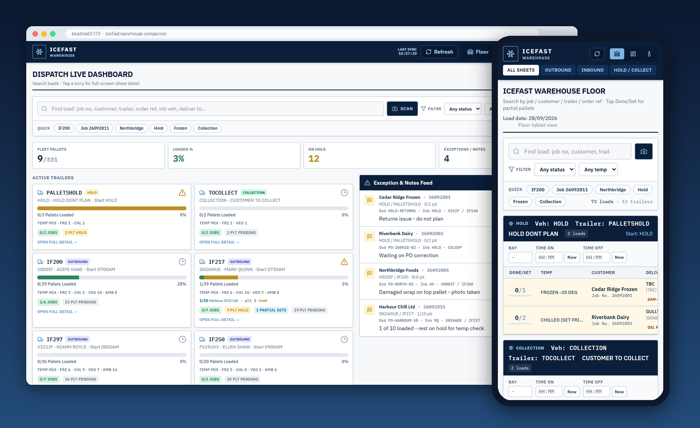

# IceFast

Local-first **warehouse companion** PWA for cold-chain Floor sheets, Dispatch board, yard Temps, and on-device sheet Scan. Fictional SQLite demo day; Mandata handshake modules are stubs (no HTTP).



**Changelog:** [CHANGELOG.md](CHANGELOG.md) · **Docs:** [docs/README.md](docs/README.md) · **License:** [MIT](LICENSE)

### Tech stack

<table>
<tr>
<td valign="middle" width="140">
&nbsp;<b>Core</b>
</td>
<td>

[](https://developer.mozilla.org/en-US/docs/Web/JavaScript)
[](https://react.dev/)
[](https://vitejs.dev/)
[](https://nodejs.org/)

</td>
</tr>
<tr>
<td valign="middle" width="140">
&nbsp;<b>App&nbsp;/&nbsp;PWA</b>
</td>
<td>

[](https://web.dev/progressive-web-apps/)
[](https://tailwindcss.com/)
[](https://sql.js.org/)
[](https://tesseract.projectnaptha.com/)

</td>
</tr>
<tr>
<td valign="middle" width="140">
&nbsp;<b>Tooling&nbsp;&amp;&nbsp;CI</b>
</td>
<td>

[](https://vitest.dev/)
[](https://testing-library.com/)
[](https://github.com/gitleaks/gitleaks)
[](https://github.com/Metaheurist/IceFast/actions)

</td>
</tr>
</table>

**Repository:** [github.com/Metaheurist/IceFast](https://github.com/Metaheurist/IceFast)

[](https://github.com/Metaheurist/IceFast/actions/workflows/ci.yml)

---

### Documentation

| | |
| :--- | :--- |
|  | **[Security](docs/SECURITY.md)** - seed rules, CI audit/Gitleaks |
|  | **[App overview](docs/app-and-features.md)** - Floor, Dispatch, Temps, Scan |
|  | **[Installation & usage](docs/setup-and-usage.md)** - scripts, PWA, date override |
|  | **[Testing & configuration](docs/testing-and-configuration.md)** - Vitest map, seed rules |
|  | **[Build, test & CI](docs/build-test-and-ci.md)** - scripts, Actions |
|  | **[Architecture](docs/architecture.md)** - source map, AppContext, PWA |
|  | **[Data and seed](docs/data.md)** - `demo.db`, schema, fictional-data tests |
|  | **[Mandata handshake](docs/mandata.md)** - stub DTO writers |
|  | **[Known issues](docs/known-issues.md)** - persistence, OCR, PWA, seed |
|  | **[Project reference](docs/project-reference.md)** - tree and dependencies |
|  | **[Changelog](docs/CHANGELOG.md)** |
|  | **[About](docs/about-and-support.md)** |
|  | **[Contributing](CONTRIBUTING.md)** |

Demo seed is fictional. Temps banner: `Demo only - not connected to Mandata Enterprise TMS`.

---

## Features

- **Floor** - `FloorView.jsx`: status, pallet log, notes, bay times
- **Dispatch** - `DashboardView.jsx`: trailer progress, holds, live feed
- **Temps** - `TempsView.jsx`: yard units, goods °C, reefer zones, ops thread
- **Scan** - `SheetScanModal.jsx` + `localOcr.js`: local Tesseract match to active jobs

Detail: [docs/app-and-features.md](docs/app-and-features.md) · [docs/views.md](docs/views.md).

### Screenshots

<table>
<tr>
<td width="50%" valign="top"><a href="docs/views.md#floor"></a></td>
<td width="50%" valign="top"><a href="docs/views.md#dispatch"></a></td>
</tr>
<tr>
<td align="center"><b>Floor</b> - trailer sheets, pallet progress, notes</td>
<td align="center"><b>Dispatch</b> - fleet totals, trailer cards, exception feed</td>
</tr>
<tr>
<td width="50%" valign="top"><a href="docs/views.md#temps"></a></td>
<td width="50%" valign="top"><a href="docs/views.md#scan"></a></td>
</tr>
<tr>
<td align="center"><b>Temps</b> - open loads, parked reefers, ops thread</td>
<td align="center"><b>Scan</b> - on-device OCR matched to active jobs</td>
</tr>
</table>

Captured from `npm run dev` with the fictional demo day. More per view in [docs/views.md](docs/views.md); phone layouts in [docs/setup-and-usage.md](docs/setup-and-usage.md#install-as-a-pwa).

---

## Quick start

```bash
npm install
npm run dev
```

`predev` rebuilds `public/demo.db` and syncs OCR into `public/ocr`. Override sheet date with `DEMO_LOAD_DATE=DD/MM/YYYY`.

Commands: [docs/setup-and-usage.md](docs/setup-and-usage.md).

---

## Tests

```bash
npm test
npm run test:watch
npm run test:coverage
```

Suites: [docs/testing-and-configuration.md](docs/testing-and-configuration.md). CI: [docs/build-test-and-ci.md](docs/build-test-and-ci.md).

---

## Handshake stubs

`src/integrations/mandataHandshake.js`: `toMandataJobPatch`, `toMandataAssetTemp`, `toMandataEvent`. No HTTP.

[docs/mandata.md](docs/mandata.md) · [docs/data.md](docs/data.md).

---

## Security

[docs/SECURITY.md](docs/SECURITY.md). Root [`SECURITY.md`](SECURITY.md) points at that file.

---

## License

[MIT](LICENSE)
