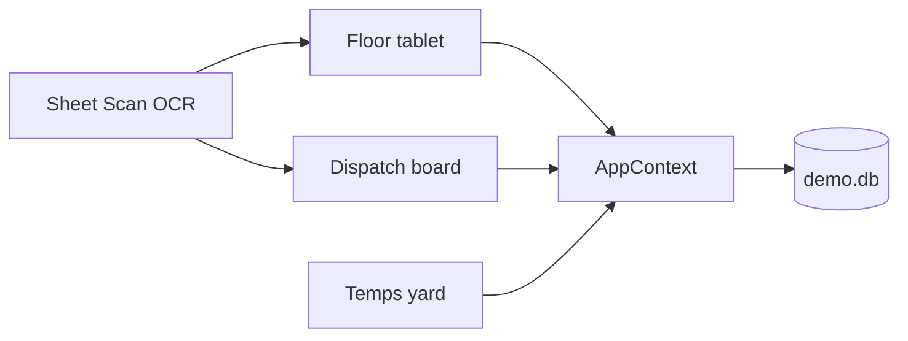

# App overview & features

**IceFast** is an open-source warehouse companion for cold-chain operations. Floor staff and traffic share one local day of work instead of paper sheets and ad-hoc messaging threads.

A TMS (for example Mandata Enterprise, formerly Manpack) can remain the planner’s system of record. IceFast sits beside it: sheets, pallet progress, notes, and the yard temps loop that the TMS does not replace on the dock.

## Who it is for

| Role | View | Job |
| --- | --- | --- |
| Warehouse / checker | **Floor** | Mark pallets, cycle status, note exceptions, log bay times |
| Traffic / dispatch | **Dispatch** | Watch trailer progress, holds, and the live notes feed |
| Yard / cross-dock | **Temps** | Parked boxes, bay, goods °C, reefer zones, ops thread |
| Anyone with a sheet photo | **Scan** | Photograph a printed sheet and jump to the matching load |

State is shared in the browser. A Floor tap shows up immediately on Dispatch. Temps actions append an ops-thread line and a stub Mandata handshake payload.

## What it replaces

- Paper **inbound** and **outbound** warehouse sheets
- Ad-hoc notes / hold messages to dispatch
- The **Temperatures / Part loads** style messaging group (parked-up trailer, bay, controller proof)

## Features by view

### Floor

Tablet/phone warehouse sheet (`FloorView.jsx`).

- Direction chips: All / Outbound / Inbound / Hold / Collect
- Trailer blocks with vehicle, trailer, driver, bay, times, checker
- Job rows: pallet progress, temp band, customer, Job No., status, note
- Tap status to cycle Pending → Loaded → Hold
- Pallet log modal and note modal (notes land on the Dispatch live feed)
- Search, filters, and **Scan** entry

### Dispatch

Desktop traffic dashboard (`DashboardView.jsx`).

- Trailer cards with pallet progress bars and hold emphasis
- Job-level detail (collect/deliver, order ref, inbound lineage, notes)
- **Live feed** of status, pallet, note, and bay/checker updates from Floor
- Same search / Scan as Floor (shared `AppContext`)

### Temps

Yard / part-load board (`TempsView.jsx`).

- Mandata-shaped labels: Job No, Vehicle, Trailer, Work type, Bay
- Open loads, available/parked units, ops thread
- Goods °C vs dual-zone reefer set/actual (never mixed)
- Assign parked, bay, goods, reefer, VOR actions
- Each action sets a stub handshake DTO (`lastHandshake`)

Banner: `Demo only - not connected to Mandata Enterprise TMS`.

### Scan

On-device Tesseract.js OCR (`SheetScanModal.jsx`, `localOcr.js`).

1. Live camera or photo
2. Local worker reads text (assets under `/ocr`, no CDN at runtime)
3. Tokens match active jobs
4. Choosing a hit fills search so Floor/Dispatch jump to that load

A demo sample path exists for walkthroughs without a printed sheet.

## What it does not do

Out of scope for the current prototype:

- Live Mandata (or other TMS) credentials or HTTP
- Replacing a Mandata Manifest-style driver app
- Live Thermo King / Webfleet telematics
- Camera capture of reefer controllers
- Importing real messaging history
- Live client, driver, or job-number data (seed is fictional)

Deeper UI detail: [views.md](views.md). Product summary: [overview.md](overview.md).
