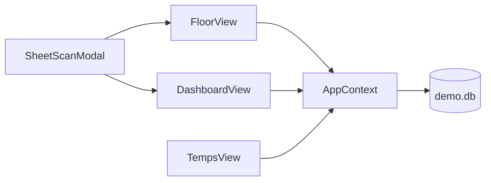
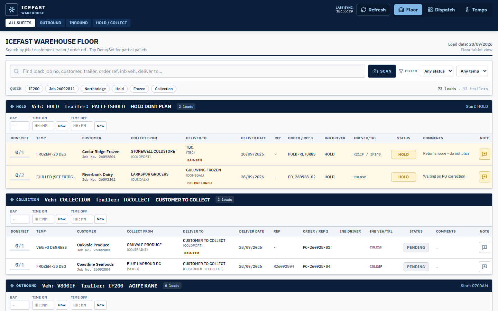
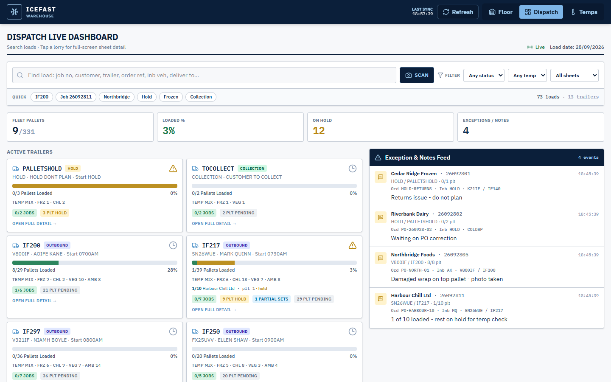
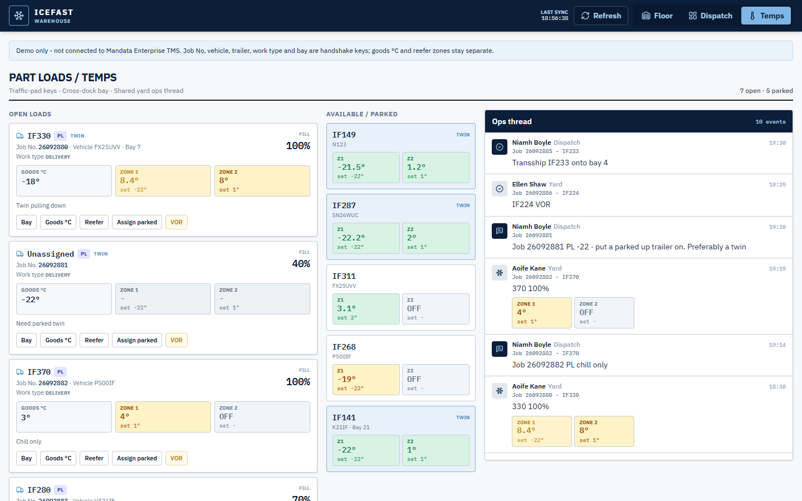
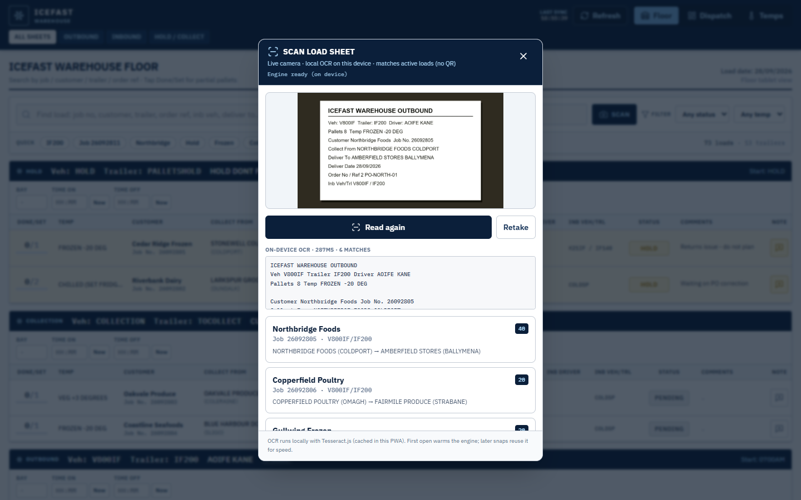

# App overview

Vite + React PWA. Shared day state in `AppContext`. Views: Floor, Dispatch, Temps; Scan is a modal from the search bar.

| View | Component | Role |
| --- | --- | --- |
| Floor | `src/components/FloorView.jsx` | Sheet status, pallets, notes, bay times |
| Dispatch | `src/components/DashboardView.jsx` | Trailer progress, holds, live feed |
| Temps | `src/components/TempsView.jsx` | Yard units, goods °C, reefer zones, ops thread |
| Scan | `src/components/SheetScanModal.jsx` + `src/ocr/localOcr.js` | Local Tesseract match to active jobs |

Floor and Dispatch share `AppContext` (search, filters, trailers, feed). Temps actions set `lastHandshake` via `src/integrations/mandataHandshake.js`.

### Floor

- Direction chips: All / Outbound / Inbound / Hold / Collect
- Trailer blocks: vehicle, trailer, driver, bay, times, checker
- Job rows: pallets, temp band, customer, Job No., status, note
- Status cycle: Pending → Loaded → Hold
- Modals: `PalletLogModal.jsx`, `NoteModal.jsx` (notes go to Dispatch feed)
- Search / filters / Scan: `LoadSearchBar.jsx`

### Dispatch

- Trailer cards with pallet progress and hold emphasis
- Job detail: collect/deliver, order ref, inbound lineage, notes
- Live feed from Floor mutations
- Same search / Scan as Floor

### Temps

- Labels: Job No, Vehicle, Trailer, Work type, Bay
- Columns: open loads, parked units, ops thread
- Goods °C (`goodsTempC`) and Zone 1 / Zone 2 reefer fields are separate
- Actions: assign parked, bay, goods, reefer, VOR → yard event + handshake DTO
- Banner copy: `Demo only - not connected to Mandata Enterprise TMS`

### Scan

1. Camera or photo
2. Worker reads text from `/ocr` assets (no CDN at runtime)
3. `matchLoadsFromSheetText` in `src/data.js`
4. Hit fills search so Floor/Dispatch jump to that load

Demo sample: `buildDemoOcrSample` in OCR helpers (fictional IF200).

UI detail and more screenshots (modals, trailer detail, reefer dialog, scan camera): [views.md](views.md).
