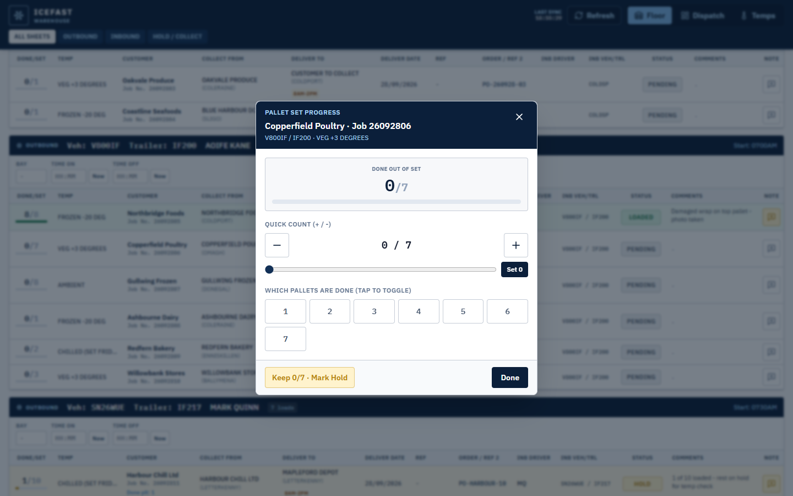
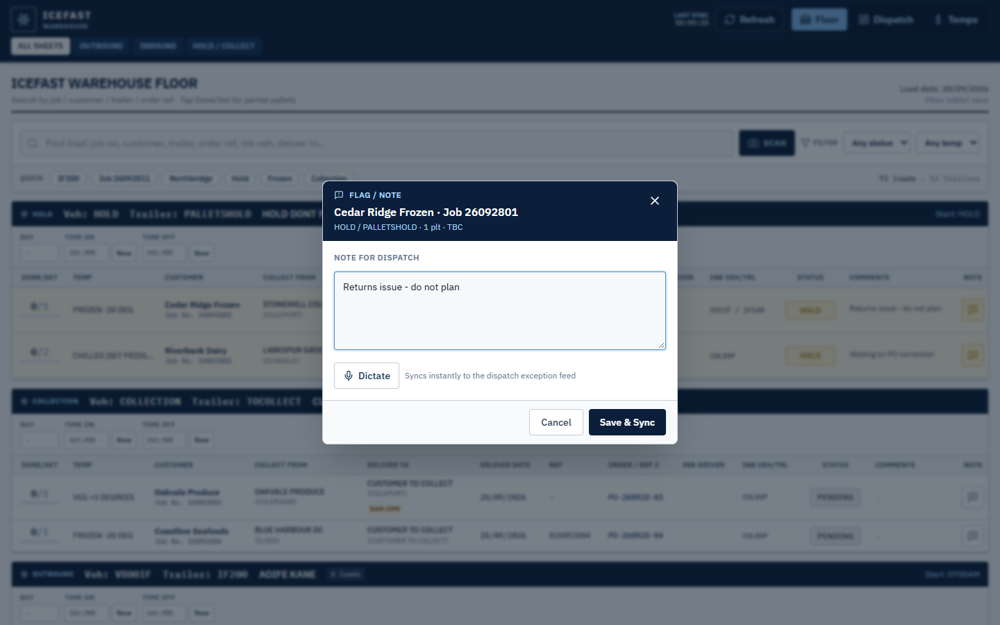
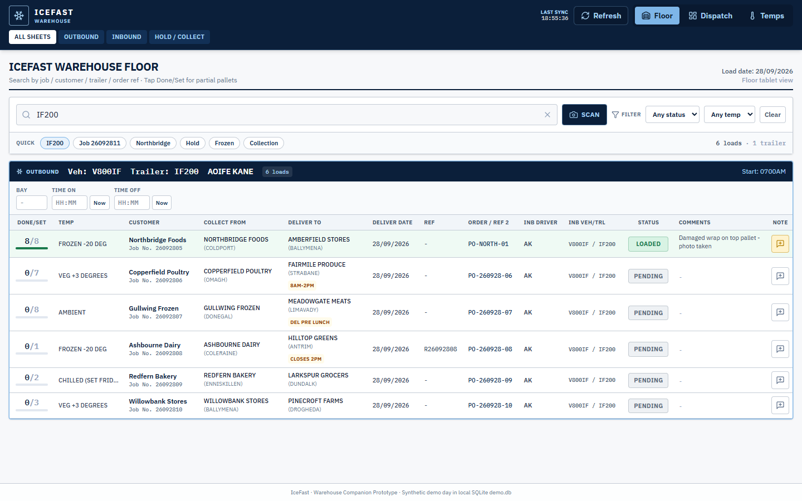
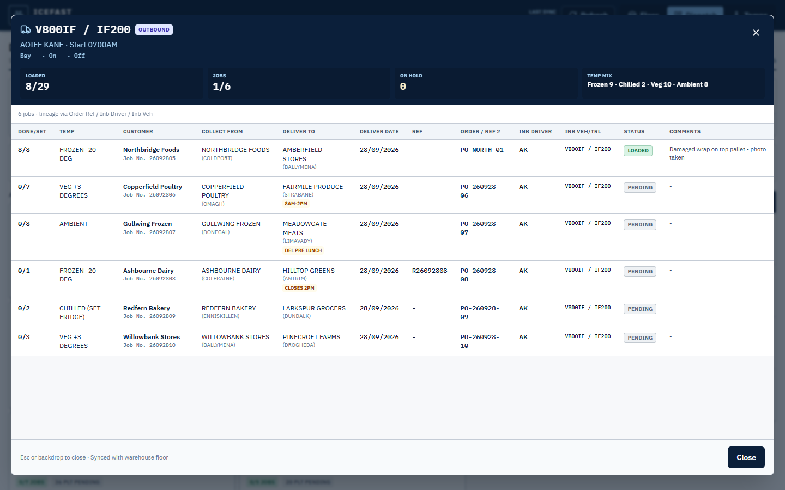
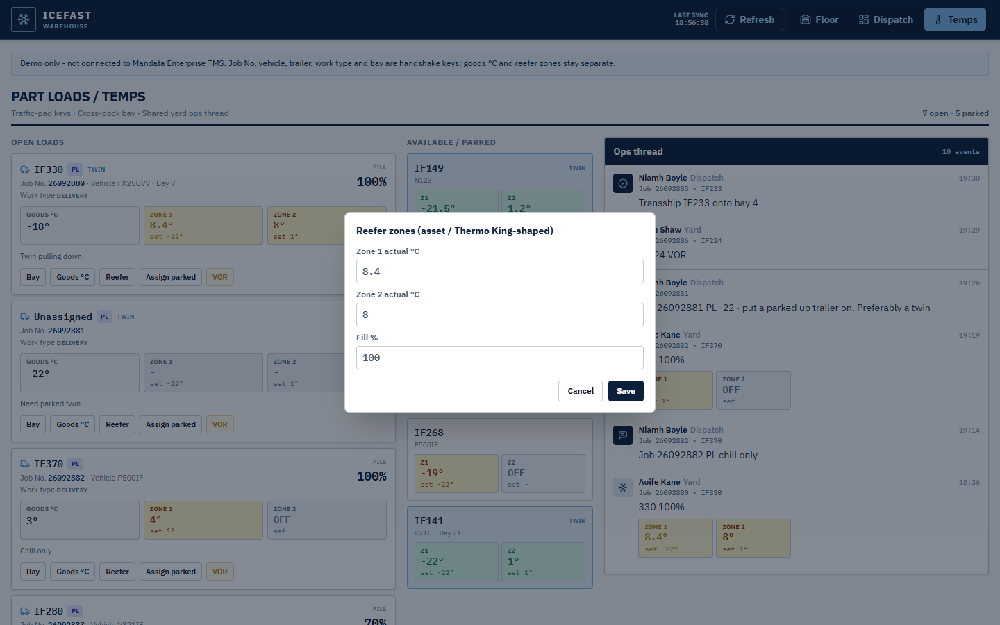
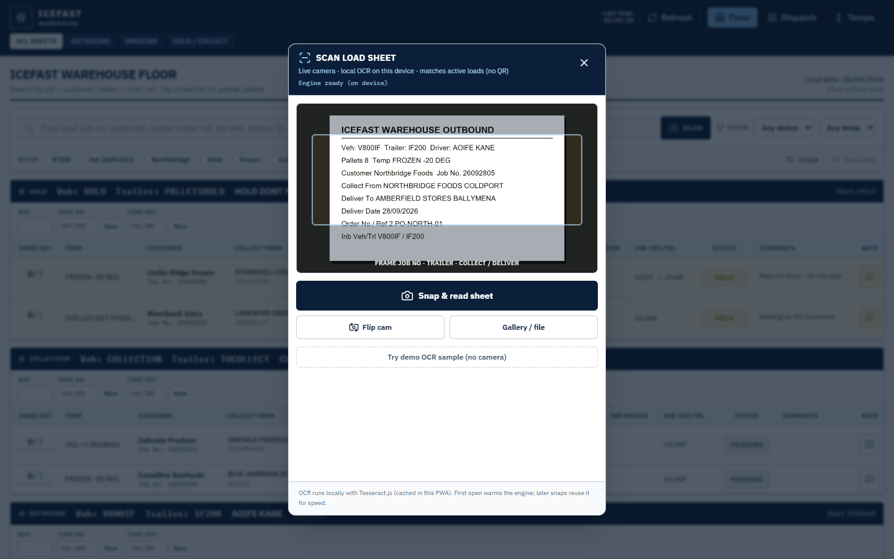

# Views

Header nav: **Floor** · **Dispatch** · **Temps**. Scan opens from the search bar on Floor and Dispatch (`LoadSearchBar.jsx`).

Screenshots are 1440 x 900 captures of `npm run dev` with the fictional demo day; phone layouts are in [setup-and-usage.md](setup-and-usage.md#install-as-a-pwa).

## Floor

`src/components/FloorView.jsx`

Direction chips: All sheets, Outbound, Inbound, Hold / Collect.

Trailer block fields: vehicle, trailer, driver, direction badge, bay, time on/off, inbound checker, bay dwell. Job rows: pallet progress, temp band, customer, Job No., collect, deliver, window, status, note.

| Action | Behaviour |
| --- | --- |
| Tap status | Pending → Loaded → Hold → Pending. Loaded fills pallet numbers. Hold keeps partial progress. |
| Tap pallet count | `PalletLogModal` - toggle pallets, set count, or Hold |
| Note | `NoteModal` - typed (SpeechRecognition where available). Notes appear on Dispatch feed |
| Search / filters | Job No, customer, trailer, temp band, status |
| Scan | `SheetScanModal` - see [Scan](#scan) |

Hold / Collection buckets use vehicle labels `HOLD` / `COLLECTION` (trailers `PALLETSHOLD` / `TOCOLLECT`).

| Pallet log (`PalletLogModal`) | Note (`NoteModal`) |
| --- | --- |
|  |  |

Quick filter **IF200** narrows the sheet to one trailer (6 loads):

## Dispatch

`src/components/DashboardView.jsx`

- Trailer cards: pallet bars, direction / temp-mix badges, hold emphasis
- Card detail: collect/deliver, order ref, inbound vehicle lineage, notes
- Live feed: status, pallet, note, bay/checker updates from Floor

**Open full detail** on a card opens `TrailerDetailModal` - the whole sheet for that trailer (table at `xl`, stacked cards below):

Search and Scan match Floor. Shared `AppContext` - no separate sync.

## Temps

`src/components/TempsView.jsx`

Labels: **Job No, Vehicle, Trailer, Work type, Bay**. **PL** / **FL** badges map to `collection` / `delivery` / `trunk` / `fullMove` yard kinds.

Columns:

1. **Open loads** - fill %, goods °C, Zone 1 / Zone 2 set vs actual (status colours from `reeferZoneStatus`)
2. **Available / parked** - unassigned units; **Twin** when dual-zone
3. **Ops thread** - yard events; reefer proof is the dual-zone widget payload

| Action | Job fields | Asset fields |
| --- | --- | --- |
| Bay | `bayNo` | - |
| Goods °C | `goodsTempC` | - |
| Reefer | - | Zone 1 / Zone 2 set vs actual |
| Assign parked | vehicle, trailer, twin, actuals onto open load | parked unit → empty |
| VOR | status / yard kind | - |

Each action appends a yard event and sets `lastHandshake` ([mandata.md](mandata.md)).

**Reefer** edits the unit's Zone 1 / Zone 2 actuals and fill %:

Banner: `Demo only - not connected to Mandata Enterprise TMS`.

## Scan

`src/components/SheetScanModal.jsx`, `src/ocr/localOcr.js`

1. Camera (rear preferred) or photo pick
2. Frame downscaled + greyscaled
3. Local Tesseract worker (`/ocr`, vendored by `npm run ocr:sync`)
4. Token match via `matchLoadsFromSheetText` (`src/data.js`)
5. Selected hit fills search

| Camera framing | Result |
| --- | --- |
|  |  |

The result shows the recognised text, timing and matches ranked by score; the top hit here is Job 26092805 (Northbridge Foods on IF200). The sheet in these captures is the fictional `buildDemoOcrSample` text printed and fed in as a camera stream.

Demo path: `buildDemoOcrSample` (fictional IF200 outbound) via **Try demo OCR sample (no camera)**.
